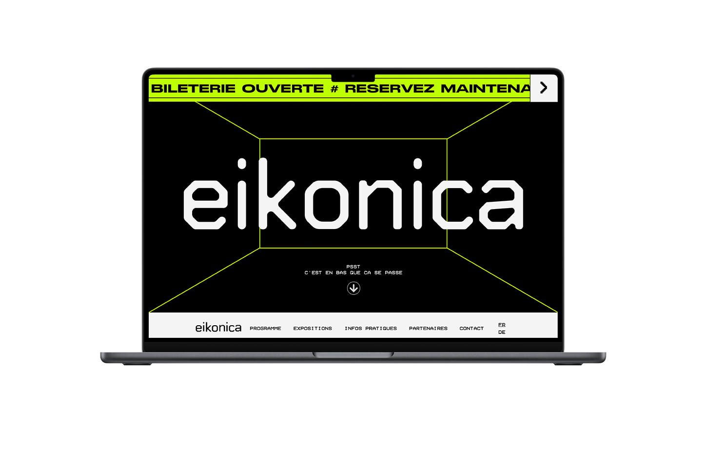

# eikonica festival website

## Introduction

The eikonica project is a fictional project imagined and created by a school for evaluate our progression.

### Gallery



## Technologies used and learned

### Little list of all the technologies I learned and used to make this website.

```
- Sketch : for the UI part
- Visual studio code : for the frontend development part
- HTML 5 : obviously
- SASS : obviously too
- JavaScript : for interactions and the box section
- Bootstrap grid : for the responsive behaviors
- SMACSS : to tidy up a bit my SCSS files
```

### List of evaluated knowledge

```
- Development environment
- Integration from Sketch
- Flexbox
- Bootstrap
- Media queries
- Positions
- Transitions
```

All of these criterias have been learned and understood.

## Useful links

Here are more links to my work.

<a href="https://www.behance.net/franoisdevantay" target="_blank">My personal Behance</a>
<a href="https://www.youtube.com/channel/@ELADEstudioOff" target="_blank">Elade/ studio youtube channel</a>
